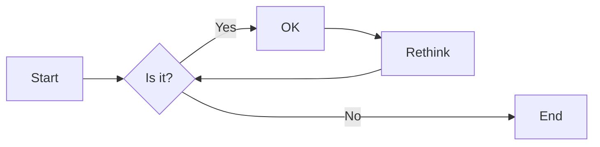
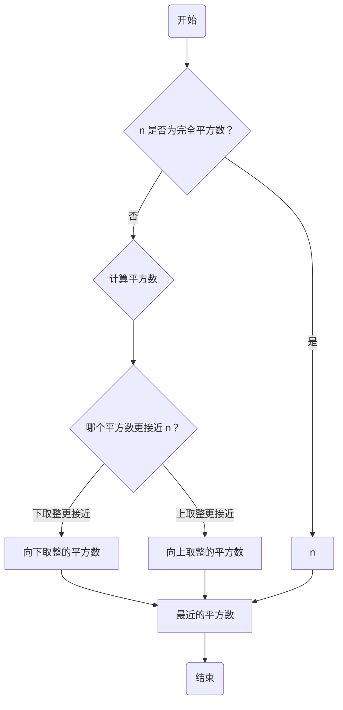
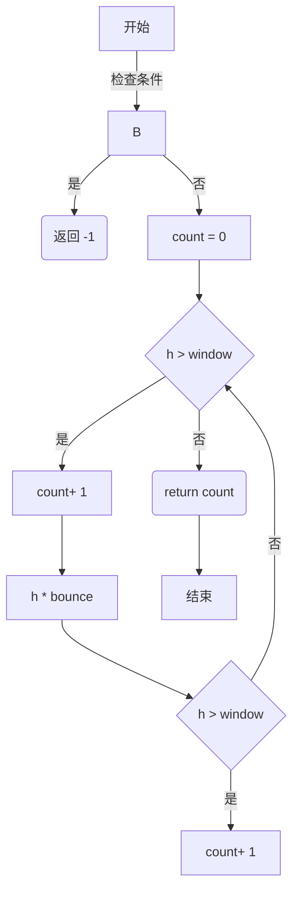
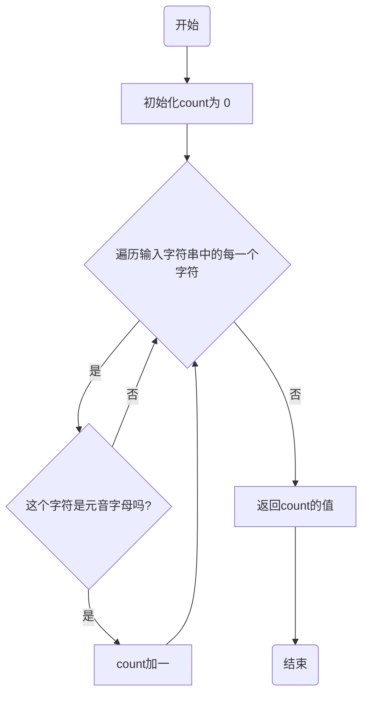
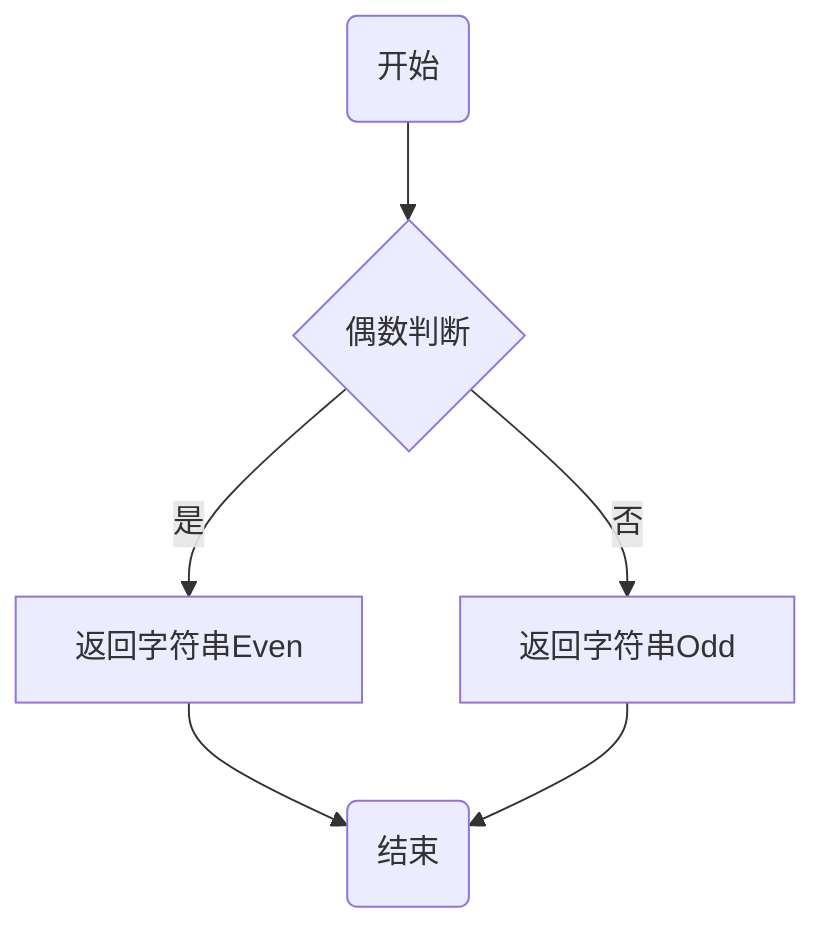

# 实验二 Python变量、简单数据类型

班级： 21计科3

学号： 20210302307

姓名： 梁宇晨

Github地址：<https://github.com/zzldy4/python-homework>

CodeWars地址：<https://www.codewars.com/users/zzldy>

---

## 实验目的

1. 使用VSCode编写和运行Python程序
2. 学习Python变量和简单数据类型

## 实验环境

1. Git
2. Python 3.10
3. VSCode
4. VSCode插件

## 实验内容和步骤

### 第一部分

实验环境的安装

1. 安装Python，从Python官网下载Python 3.10安装包，下载后直接点击可以安装：[Python官网地址](https://www.python.org/downloads/)
2. 为了在VSCode集成环境下编写和运行Python程序，安装下列VScode插件
   - Python
   - Python Environment Manager
   - Python Indent
   - Python Extended
   - Python Docstring Generator
   - Jupyter
   - indent-rainbow
   - Jinja

---

### 第二部分

Python变量、简单数据类型和列表简介

完成教材《Python编程从入门到实践》下列章节的练习：

- 第2章 变量和简单数据类型

---

### 第三部分

在[Codewars网站](https://www.codewars.com)注册账号，完成下列Kata挑战：

---

#### 第1题：求离整数n最近的平方数（Find Nearest square number）

难度：8kyu

你的任务是找到一个正整数n的最近的平方数
例如，如果n=111，那么nearest_sq(n)（nearestSq(n)）等于121，因为111比100（10的平方）更接近121（11的平方）。
如果n已经是完全平方（例如n=144，n=81，等等），你需要直接返回n。
代码提交地址
<https://www.codewars.com/kata/5a805d8cafa10f8b930005ba>

---

#### 第2题：弹跳的球（Bouncing Balls）

难度：6kyu

一个孩子在一栋高楼的第N层玩球。这层楼离地面的高度h是已知的。他把球从窗口扔出去。球弹了起来,  例如:弹到其高度的三分之二（弹力为0.66）。他的母亲从离地面w米的窗户向外看,母亲会看到球在她的窗前经过多少次（包括球下落和反弹的时候）？

一个有效的实验必须满足三个条件：

- 参数 "h"（米）必须大于0
- 参数 "bounce "必须大于0且小于1
- 参数 “window "必须小于h。

如果以上三个条件都满足，返回一个正整数，否则返回-1。
**注意:只有当反弹球的高度严格大于窗口参数时，才能看到球。**
代码提交地址
<https://www.codewars.com/kata/5544c7a5cb454edb3c000047/train/python>

---

#### 第3题： 元音统计(Vowel Count)

难度： 7kyu

返回给定字符串中元音的数量（计数）。对于这个Kata，我们将考虑a、e、i、o、u作为元音（但不包括y）。输入的字符串将只由小写字母和/或空格组成。

代码提交地址：
<https://www.codewars.com/kata/54ff3102c1bad923760001f3>

---

#### 第4题：偶数或者奇数（Even or Odd）

难度：8kyu

创建一个函数接收一个整数作为参数，当整数为偶数时返回”Even”当整数位奇数时返回”Odd”。
代码提交地址：
<https://www.codewars.com/kata/53da3dbb4a5168369a0000fe>

### 第四部分

使用Mermaid绘制程序流程图

安装Mermaid的VSCode插件：

- Markdown Preview Mermaid Support
- Mermaid Markdown Syntax Highlighting

使用Markdown语法绘制你的程序绘制程序流程图（至少一个），Markdown代码如下：


显示效果如下：



查看Mermaid流程图语法-->[点击这里](https://mermaid.js.org/syntax/flowchart.html)

使用Markdown编辑器（例如VScode）编写本次实验的实验报告，包括[实验过程与结果](#实验过程与结果)、[实验考查](#实验考查)和[实验总结](#实验总结)，并将其导出为 **PDF格式** 来提交。

## 实验过程与结果

请将实验过程与结果放在这里，包括：

- [第二部分 Python变量、简单数据类型和列表简介](#第二部分)
- [第三部分 Codewars Kata挑战](#第三部分)
1. 第一题
```python
import math
def nearest_sq(n):
    if math.isqrt(n) ** 2 == n:
        return n
    
    lower_sq = math.isqrt(n) ** 2
    upper_sq = (math.isqrt(n) + 1) ** 2
    
    if n - lower_sq < upper_sq - n:
        return lower_sq
    else:
        return upper_sq
```
2. 第二题
```python
def bouncing_ball(h, bounce, window):
    # your code
    if h <= 0 or bounce <= 0 or bounce >= 1 or window >= h:
        return -1
    
    count = 0
    while h > window:
        count += 1
        h *= bounce
        if h > window:
            count += 1
    return count
```
3. 第三题
```python
def get_count(sentence):
    vowels = 'aeiou'
    count = 0
    for letter in sentence:
        if letter in vowels:
            count += 1
    return count
```
4. 第四题
```python
def even_or_odd(number):
    if number % 2 == 0:
        return "Even"
    else:
        return "Odd"
```
- [第四部分 使用Mermaid绘制程序流程图](#第四部分)
1. 求离整数n最近的平方数（Find Nearest square number）

2. 弹跳的球（Bouncing Balls）

3. 第3题： 元音统计(Vowel Count)

4. 偶数或者奇数（Even or Odd）

注意代码需要使用markdown的代码块格式化，例如Git命令行语句应该使用下面的格式：


显示效果如下：

```bash
git init
git add .
git status
git commit -m "first commit"
```

如果是Python代码，应该使用下面代码块格式，例如：


显示效果如下：

```python
def add_binary(a,b):
    return bin(a+b)[2:]
```

代码运行结果的文本可以直接粘贴在这里。

**注意：不要使用截图，Markdown文档转换为Pdf格式后，截图可能会无法显示。**

## 实验考查

请使用自己的语言并使用尽量简短代码示例回答下面的问题，这些问题将在实验检查时用于提问和答辩以及实际的操作。

1. Python中的简单数据类型有那些？我们可以对这些数据类型做哪些操作？
```
Python中的简单数据类型包括整数（int）、浮点数（float）、布尔值（bool）、字符串（str）和空值（None）。对于这些数据类型，我们可以进行各种操作：
对于整数和浮点数，我们可以进行基本的数学运算（如加减乘除），还可以进行比较操作（如大于、小于、等于）。
布尔值可以进行逻辑运算（如与、或、非），也可以进行比较操作。
字符串可以进行拼接、切片、替换等操作，还有很多内置的字符串方法可以使用。
空值通常用于表示不存在或未定义的变量，不能进行任何操作。
```
2. 为什么说Python中的变量都是标签？
```
在Python中，变量实际上是指向数据对象的标签，而不是存储数据本身的容器。当我们给变量赋值时，实际上是将变量标签指向了保存数据的内存地址。这种机制也被称为对象引用。由于变量只是数据对象的标签，所以可以灵活地指向不同类型的对象，并且可以同时指向同一个对象。这种特性使得Python中的变量更加灵活和方便使用。
```
3. 有哪些方法可以提高Python代码的可读性？
```
有以下几种方法可以提高Python代码的可读性：

使用有意义的变量名：变量名应该能够清晰地表达变量的含义，避免使用过于简单或无意义的名称。
适当添加注释：在关键位置添加注释，描述代码的功能和实现思路，方便其他人理解和维护。
使用空格和缩进：合理使用空格和缩进来组织代码结构，使其更易读，同时遵循Python的缩进规则。
模块化和函数化：将代码分解为逻辑单元的函数或模块，提高代码的可维护性和重用性。
合理命名函数和方法：函数和方法的命名应该清晰地表达其功能，遵循命名规范，使其易于理解。
避免过长的代码行：一行代码应尽量保持在80个字符以内，避免过长的行导致阅读困难。
使用合适的空行和代码块分割：使用空行和适当的代码块分割来增加代码的可读性，使其更易理解逻辑结构。
```

## 实验总结

总结一下这次实验你学习和使用到的知识，例如：编程工具的使用、数据结构、程序语言的语法、算法、编程技巧、编程思想。
1. 这次实验学习了Mermaid流程图语法，同时在完成题目的同时也复习了相关的数据结构.对python有了更深刻的了解。