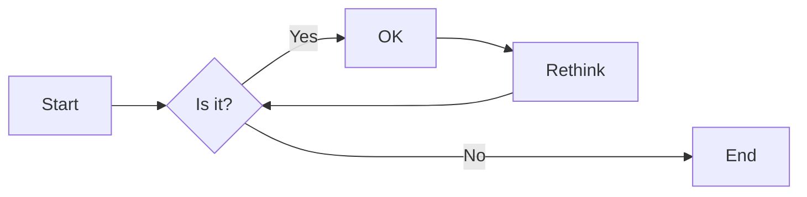

# 实验六 Python函数

班级： 21计科3

学号： 20210302307

姓名： 梁宇晨

Github地址：<https://github.com/zzldy4/python-homework>

CodeWars地址：<https://www.codewars.com/users/zzldy>

---

## 实验目的

1. 学习Python函数的基本用法
2. 学习lambda函数和高阶函数的使用
3. 掌握函数式编程的概念和实践

## 实验环境

1. Git
2. Python 3.10
3. VSCode
4. VSCode插件

## 实验内容和步骤

### 第一部分

Python函数

完成教材《Python编程从入门到实践》下列章节的练习：

- 第8章 函数

---

### 第二部分

在[Codewars网站](https://www.codewars.com)注册账号，完成下列Kata挑战：

---

#### 第一题：编码聚会1

难度： 7kyu

你将得到一个字典数组，代表关于首次报名参加你所组织的编码聚会的开发者的数据。
你的任务是返回来自欧洲的JavaScript开发者的数量。
例如，给定以下列表：

```python
lst1 = [
  { 'firstName': 'Noah', 'lastName': 'M.', 'country': 'Switzerland', 'continent': 'Europe', 'age': 19, 'language': 'JavaScript' },
  { 'firstName': 'Maia', 'lastName': 'S.', 'country': 'Tahiti', 'continent': 'Oceania', 'age': 28, 'language': 'JavaScript' },
  { 'firstName': 'Shufen', 'lastName': 'L.', 'country': 'Taiwan', 'continent': 'Asia', 'age': 35, 'language': 'HTML' },
  { 'firstName': 'Sumayah', 'lastName': 'M.', 'country': 'Tajikistan', 'continent': 'Asia', 'age': 30, 'language': 'CSS' }
]
```

你的函数应该返回数字1。
如果，没有来自欧洲的JavaScript开发人员，那么你的函数应该返回0。

注意：
字符串的格式将总是"Europe"和"JavaScript"。
所有的数据将始终是有效的和统一的，如上面的例子。

这个卡塔是Coding Meetup系列的一部分，其中包括一些简短易行的卡塔，这些卡塔是为了让人们掌握高阶函数的使用。在Python中，这些方法包括：`filter`, `map`, `reduce`。当然也可以采用其他方法来解决这些卡塔。

[代码提交地址](https://www.codewars.com/kata/coding-meetup-number-1-higher-order-functions-series-count-the-number-of-javascript-developers-coming-from-europe)

---

#### 第二题： 使用函数进行计算

难度：5kyu

这次我们想用函数来写计算，并得到结果。让我们看一下一些例子：

```python
seven(times(five())) # must return 35
four(plus(nine())) # must return 13
eight(minus(three())) # must return 5
six(divided_by(two())) # must return 3
```

要求：

- 从0（"零"）到9（"九"）的每个数字都必须有一个函数。
- 必须有一个函数用于以下数学运算：加、减、乘、除。
- 每个计算都由一个操作和两个数字组成。
- 最外面的函数代表左边的操作数，最里面的函数代表右边的操作数。
- 除法应该是整数除法。

例如，下面的计算应该返回2，而不是2.666666...。

```python
eight(divided_by(three()))
```

代码提交地址：
<https://www.codewars.com/kata/525f3eda17c7cd9f9e000b39>

---

#### 第三题： 缩短数值的过滤器(Number Shortening Filter)

难度：6kyu

在这个kata中，我们将创建一个函数，它返回另一个缩短长数字的函数。给定一个初始值数组替换给定基数的 X 次方。如果返回函数的输入不是数字字符串，则应将输入本身作为字符串返回。

例子：

```python
filter1 = shorten_number(['','k','m'],1000)
filter1('234324') == '234k'
filter1('98234324') == '98m'
filter1([1,2,3]) == '[1,2,3]'
filter2 = shorten_number(['B','KB','MB','GB'],1024)
filter2('32') == '32B'
filter2('2100') == '2KB';
filter2('pippi') == 'pippi'
```

代码提交地址：
<https://www.codewars.com/kata/56b4af8ac6167012ec00006f>

---

#### 第四题： 编码聚会7

难度： 6kyu

您将获得一个对象序列，表示已注册参加您组织的下一个编程聚会的开发人员的数据。

您的任务是返回一个序列，其中包括最年长的开发人员。如果有多个开发人员年龄相同，则将他们按照在原始输入数组中出现的顺序列出。

例如，给定以下输入数组：

```python
list1 = [
  { 'firstName': 'Gabriel', 'lastName': 'X.', 'country': 'Monaco', 'continent': 'Europe', 'age': 49, 'language': 'PHP' },
  { 'firstName': 'Odval', 'lastName': 'F.', 'country': 'Mongolia', 'continent': 'Asia', 'age': 38, 'language': 'Python' },
  { 'firstName': 'Emilija', 'lastName': 'S.', 'country': 'Lithuania', 'continent': 'Europe', 'age': 19, 'language': 'Python' },
  { 'firstName': 'Sou', 'lastName': 'B.', 'country': 'Japan', 'continent': 'Asia', 'age': 49, 'language': 'PHP' },
]
```

您的程序应该返回如下结果：

```python
[
  { 'firstName': 'Gabriel', 'lastName': 'X.', 'country': 'Monaco', 'continent': 'Europe', 'age': 49, 'language': 'PHP' },
  { 'firstName': 'Sou', 'lastName': 'B.', 'country': 'Japan', 'continent': 'Asia', 'age': 49, 'language': 'PHP' },
]
```

注意：

- 输入的列表永远都包含像示例中一样有效的正确格式的数据，而且永远不会为空。

代码提交地址：
<https://www.codewars.com/kata/582887f7d04efdaae3000090>

---

#### 第五题： Currying versus partial application

难度： 4kyu

[Currying versus partial application](https://2ality.com/2011/09/currying-vs-part-eval.html)是将一个函数转换为具有更小arity(参数更少)的另一个函数的两种方法。虽然它们经常被混淆，但它们的工作方式是不同的。目标是学会区分它们。

Currying

是一种将接受多个参数的函数转换为以每个参数都只接受一个参数的一系列函数链的技术。

Currying接受一个函数：

```python
f：X × Y → R
```

并将其转换为一个函数：

```python
f'：X → (Y → R)
```

我们不再使用两个参数调用f，而是使用第一个参数调用f'。结果是一个函数，然后我们使用第二个参数调用该函数来产生结果。因此，如果非curried f被调用为：

```python
f(3, 5)
```

那么curried f'被调用为：

```python
f'(3)(5)
```

示例
给定以下函数：

```python
def add(x, y, z):
  return x + y + z
```

我们可以以普通方式调用：

```python
add(1, 2, 3) # => 6
```

但我们可以创建一个curried版本的add(a, b, c)函数：

```python
curriedAdd = lambda a: (lambda b: (lambda c: add(a,b,c)))
curriedAdd(1)(2)(3) # => 6
```

Partial application
是将一定数量的参数固定到函数中，从而产生另一个更小arity(参数更少)的函数的过程。

部分应用接受一个函数：

```python
f：X × Y → R
```

和一个固定值x作为第一个参数，以产生一个新的函数

```python
f'：Y → R
```

f'与f执行的操作相同，但只需要填写第二个参数，这就是其arity比f的arity少一个的原因。可以说第一个参数绑定到x。

示例:

```python
partialAdd = lambda a: (lambda *args: add(a,*args))
partialAdd(1)(2, 3) # => 6
```

你的任务是实现一个名为curryPartial()的通用函数，可以进行currying或部分应用。

例如：

```python
curriedAdd = curryPartial(add)
curriedAdd(1)(2)(3) # => 6

partialAdd = curryPartial(add, 1)
partialAdd(2, 3) # => 6
```

我们希望函数保持灵活性。

所有下面这些例子都应该产生相同的结果：

```python
curryPartial(add)(1)(2)(3) # =>6 
curryPartial(add, 1)(2)(3) # =>6 
curryPartial(add, 1)(2, 3) # =>6 
curryPartial(add, 1, 2)(3) # =>6 
curryPartial(add, 1, 2, 3) # =>6 
curryPartial(add)(1, 2, 3) # =>6 
curryPartial(add)(1, 2)(3) # =>6 
curryPartial(add)()(1, 2, 3) # =>6 
curryPartial(add)()(1)()()(2)(3) # =>6 

curryPartial(add)()(1)()()(2)(3, 4, 5, 6) # =>6 
curryPartial(add, 1)(2, 3, 4, 5) # =>6 

curryPartial(curryPartial(curryPartial(add, 1), 2), 3) # =>6
curryPartial(curryPartial(add, 1, 2), 3) # =>6
curryPartial(curryPartial(add, 1), 2, 3) # =>6
curryPartial(curryPartial(add, 1), 2)(3) # =>6
curryPartial(curryPartial(add, 1)(2), 3) # =>6
curryPartial(curryPartial(curryPartial(add, 1)), 2, 3) # =>6
```

代码提交地址：
<https://www.codewars.com/kata/53cf7e37e9876c35a60002c9>

---

### 第三部分

使用Mermaid绘制程序流程图

安装VSCode插件：

- Markdown Preview Mermaid Support
- Mermaid Markdown Syntax Highlighting

使用Markdown语法绘制你的程序绘制程序流程图（至少一个），Markdown代码如下：


显示效果如下：



查看Mermaid流程图语法-->[点击这里](https://mermaid.js.org/syntax/flowchart.html)

使用Markdown编辑器（例如VScode）编写本次实验的实验报告，包括[实验过程与结果](#实验过程与结果)、[实验考查](#实验考查)和[实验总结](#实验总结)，并将其导出为 **PDF格式** 来提交。

## 实验过程与结果

请将实验过程与结果放在这里，包括：

- [第一部分 Python函数](#第一部分)
- [第二部分 Codewars Kata挑战](#第二部分)
1. 第一题
[代码提交地址](https://www.codewars.com/kata/coding-meetup-number-1-higher-order-functions-series-count-the-number-of-javascript-developers-coming-from-europe)

```
def count_developers(lst):
    # Your code here
    count=0
    for i in range(0,len(lst)):
        if(lst[i]['continent']=='Europe' and lst[i]['language']=='JavaScript'):
            count+=1
    return count
```
2. 第二题
[代码提交地址](https://www.codewars.com/kata/525f3eda17c7cd9f9e000b39)
```
num_dict = {'1': 1, '2': 2, '3': 3, '4': 4, '5': 5, '6': 6, '7': 7, '8': 8, '9': 9, '0': 0}

def zero(x=None): 
    return evaluate_expression(0, x)

def one(x=None): 
    return evaluate_expression(1, x)

def two(x=None): 
    return evaluate_expression(2, x)

def three(x=None): 
    return evaluate_expression(3, x)

def four(x=None): 
    return evaluate_expression(4, x)

def five(x=None): 
    return evaluate_expression(5, x)

def six(x=None): 
    return evaluate_expression(6, x)

def seven(x=None): 
    return evaluate_expression(7, x)

def eight(x=None): 
    return evaluate_expression(8, x)

def nine(x=None): 
    return evaluate_expression(9, x)

def plus(x):
    return '+,' + str(x)

def minus(x):
    return '-,' + str(x)

def times(x):
    return '*,' + str(x)

def divided_by(x):
    return '/,' + str(x)

def evaluate_expression(x, y):
    if y is None:
        return x
    
    operator, num = y.split(',')
    num = num_dict[num]
    
    if operator == '+':
        return x + num
    elif operator == '-':
        return x - num
    elif operator == '*':
        return x * num
    elif operator == '/':
        return int(x / num)
```
3. 第三题
[代码提交地址](https://www.codewars.com/kata/56b4af8ac6167012ec00006f)
```
def shorten_number(suffixes, base):
    def filter(text):
        try:
            num = int(text)
        except (ValueError, TypeError):
            return str(text)

        i = 0
        while num > base:
            if i == len(suffixes) - 1:
                break
            num = num / base
            i += 1

        return str(int(num)) + suffixes[i]

    return filter
```
4. 第四题
[代码提交地址](https://www.codewars.com/kata/582887f7d04efdaae3000090)
```
def find_senior(lst):
    max_age = max(lst, key=lambda x: x['age'])['age']
    return [x for x in lst if x['age'] == max_age]
```
5. 第五题
[代码提交地址](https://www.codewars.com/kata/53cf7e37e9876c35a60002c9)
```
def curry_partial(f,*initial_args):
    if not callable(f): 
        return f
    num_args = f.__code__.co_argcount


    if num_args == 0:
        return f(*initial_args)

    if len(initial_args) >= num_args:
        return f(*initial_args[:num_args])

    def inner(*params):    
        all_args = [*initial_args, *params]


        if not initial_args:
            return curry_partial(f, *all_args)
   
        if not callable(initial_args[0]):
            return curry_partial(f, *all_args)


        fn = initial_args[0]
        num_args2 = fn.__code__.co_argcount

        if num_args2 == 0:
            return fn(*all_args)

        if len(all_args) >= num_args2:
            return fn(*all_args[:num_args2])
        else:
            return curry_partial(fn, *all_args)
        
    return inner
```
- [第三部分 使用Mermaid绘制程序流程图](#第三部分)
1.编码聚会1
```Mermaid
graph LR
A(开始)
B[初始化计数器count为0]
C[循环: 对于列表lst中的每个元素]
D{判断条件}
E{条件为真}
F[增加计数器count的值]
G{条件为假}
H[结束循环]
I(返回count的值)
A --> B --> C --> D
D --> E --> F --> C
D --> G --> H --> I

```

4.编码聚会7
```Mermaid
graph LR
A(开始)
B[找到最大年龄]
C[初始化max_age为列表lst中的最大年龄]
D[返回age键对应的值]
E[使用lambda函数定义比较条件]
F[找到年龄最大的字典]
G[返回最大年龄对应的字典]
H[过滤列表lst]
I[返回年龄等于最大年龄的字典列表]
A --> B
B --> C
C --> D
B --> E
E --> F
F --> G
A --> H
H --> I
G --> I
C --> H
D --> H
I --> 结束
```


注意代码需要使用markdown的代码块格式化，例如Git命令行语句应该使用下面的格式：


显示效果如下：

```bash
git init
git add .
git status
git commit -m "first commit"
```

如果是Python代码，应该使用下面代码块格式，例如：


显示效果如下：

```python
def add_binary(a,b):
    return bin(a+b)[2:]
```

代码运行结果的文本可以直接粘贴在这里。

**注意：不要使用截图，Markdown文档转换为Pdf格式后，截图可能会无法显示。**

## 实验考查

请使用自己的语言并使用尽量简短代码示例回答下面的问题，这些问题将在实验检查时用于提问和答辩以及实际的操作。

1. 什么是函数式编程范式？
函数式编程范式是一种编程范式，它将计算视为函数求值的过程，强调使用纯函数和避免共享状态和可变数据。函数式编程范式的核心思想包括函数的一等公民地位（函数可以作为参数传递、作为返回值返回、存储在数据结构中）、不可变性（避免改变变量的状态）、无副作用（函数执行不会影响除函数返回值以外的任何东西）等。
2. 什么是lambda函数？请举例说明。
Lambda函数是一种匿名函数，它是一种没有名称的函数，可以在需要函数的地方定义和使用。它通常用于简单的函数定义，不需要为函数命名或定义单独的函数。
---
示例代码：
```
square = lambda x: x**2
print(square(5))  # 输出：25
```
3. 什么是高阶函数？常用的高阶函数有哪些？这些高阶函数如何工作？使用简单的代码示例说明。


高阶函数是指接受其他函数作为参数和/或返回函数作为结果的函数。常用的高阶函数有：
1. map(function, iterable)：将函数应用于可迭代对象的每个元素，并返回结果组成的新的可迭代对象。
示例代码：
```python
numbers = [1, 2, 3, 4, 5]
squared_numbers = list(map(lambda x: x**2, numbers))
print(squared_numbers)  # 输出：[1, 4, 9, 16, 25]
```
2. filter(function, iterable)：根据函数的返回值（True或False）来过滤可迭代对象中的元素，并返回满足条件的元素组成的新的可迭代对象。
示例代码：
```python
# 使用filter函数过滤列表中的偶数
numbers = [1, 2, 3, 4, 5]
even_numbers = list(filter(lambda x: x % 2 == 0, numbers))
print(even_numbers)  # 输出：[2, 4]
```

## 实验总结

总结一下这次实验你学习和使用到的知识，例如：编程工具的使用、数据结构、程序语言的语法、算法、编程技巧、编程思想。
通过这次实验我了解到了一些高级函数的使用，同时也接触了lamda表达式的使用，能够极大简化代码。
