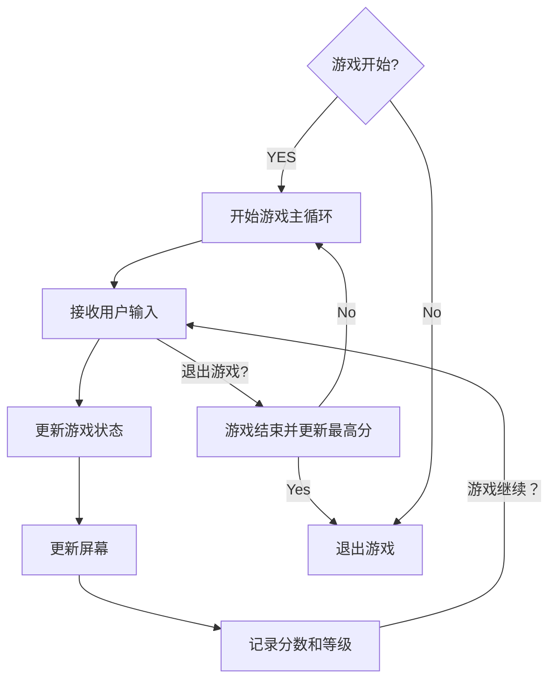
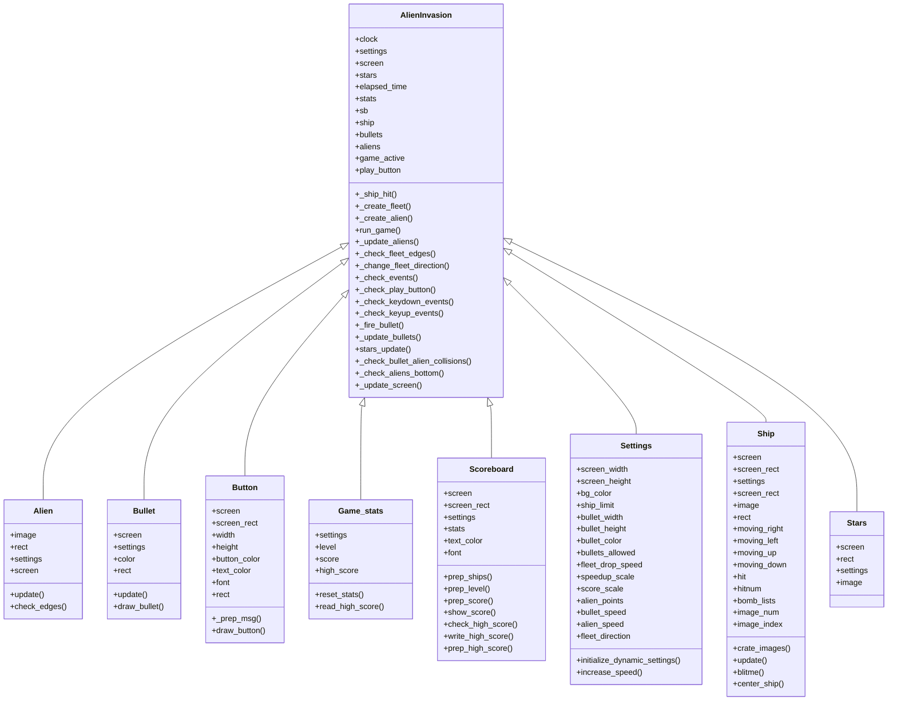

# 《Python程序设计基础》程序设计作品说明书

题目： 外星人入侵游戏

学院： 21计科03

姓名： 梁宇晨

学号： B20210302307

指导教师： 周景

起止日期：2023.11.10-2023.12.10

## 摘要

_介绍本次设计完成的项目的概述，本文的主要内容，总结你主要完成的工作以及关键词。_
本次设计完成的项目是名为"外星人大战"（Alien Invasion）的游戏。该游戏基于Pygame库开发，玩家需要控制一艘飞船与入侵地球的外星人展开激烈的战斗。

游戏的主要内容包括玩家飞船的移动和射击操作，以及外星人的生成、移动和射击行为。玩家需要通过操控飞船来尽可能地消灭它们，并获得高分。

在项目中，我主要完成了以下工作：

设计了游戏的整体架构和流程，包括游戏窗口的创建、游戏角色（飞船和外星人）的初始化、游戏事件的处理等。
实现了玩家飞船的移动控制逻辑，包括响应键盘事件来控制飞船的左右移动。
设计了外星人的生成逻辑和移动模式，使它们能够随机生成并朝着玩家飞船移动。
实现了飞船和外星人的射击行为，包括发射子弹和检测碰撞等。
设计了游戏的界面和计分系统，使玩家能够清晰地了解当前的游戏状态和得分情况。
关键词：外星人大战，Pygame库，飞船控制，外星人生成，射击行为，游戏界面，计分系统。
关键词：

## 第1章 需求分析

_本章的内容主要包括系统的需求分析，系统主要需要实现的功能有哪些，可以帮助用户解决哪些问题等等。_
1. 游戏界面：

游戏需要有一个可视化的界面，以显示游戏场景和相关元素，如飞船、外星人、子弹等。
界面应具有吸引人的图形和动画效果，以提升游戏体验。

2. 飞船控制：

玩家需要能够通过键盘或其他输入设备来控制飞船的移动。
飞船的移动应该具有平滑的动画效果，并能够在屏幕边界内自由移动。
3. 外星人生成：

游戏需要随机生成外星人，并将它们放置在屏幕上的不同位置。
外星人的生成应该具有一定的难度和挑战性，以增加游戏的乐趣。

4. 射击行为：

玩家需要能够通过按键或其他方式发射子弹来攻击外星人。
子弹应该具有一定的速度和射程，能够击中目标并造成伤害。
5. 碰撞检测：

游戏需要实现碰撞检测机制，以判断飞船的子弹是否击中了外星人，或者外星人是否撞击了飞船。
在发生碰撞时，应有相应的效果和动画，如爆炸、得分增加等。

6. 游戏进程和计分：

游戏需要记录玩家的得分，并显示在界面上。
当玩家成功击败外星人或达到一定条件时，游戏应该给予相应的奖励或进入下一关卡。
## 第2章 分析与设计

_本章的内容主要包括系统的设计，例如：系统架构、系统流程、系统模块、数据库的设计，以及关键的实现，例如：使用的数据结果、算法。_
1. 游戏场景和元素：

分析：游戏需要一个游戏窗口来显示游戏场景和相关元素，如飞船、外星人、子弹等。窗口的大小和背景可以根据需求进行设计。

设计：使用Pygame库创建游戏窗口，设置窗口大小和背景，并确保游戏元素能够正确显示在窗口中。

2. 飞船控制：

分析：玩家需要能够通过键盘或其他输入设备来控制飞船的移动。飞船的移动应该具有平滑的动画效果，并能够在屏幕边界内自由移动。

设计：监听键盘事件，根据按键的输入来控制飞船的移动。并限制其在屏幕边界内移动。

3. 外星人生成：

分析：游戏需要随机生成外星人，并将它们放置在屏幕上的不同位置。外星人的生成应具有一定的难度和挑战性。

设计：设计外星人的外观和属性，在屏幕上随机生成外星人，确保它们不会重叠，并根据游戏难度逐渐增加外星人的数量和移动速度。

4. 射击行为：

分析：玩家需要能够通过按键或其他方式发射子弹来攻击外星人。子弹应该具有一定的速度和射程，能够击中目标并造成伤害。

设计：监听键盘事件，根据按键的输入来发射子弹。设计子弹的外观和属性，并控制子弹的移动和碰撞检测，以判断是否击中外星人。

5. 碰撞检测：

分析：游戏需要实现碰撞检测机制，以判断飞船的子弹是否击中了外星人，或者外星人是否撞击了飞船。在发生碰撞时，应有相应的效果和动画，如爆炸、得分增加等。

设计：设计碰撞检测算法，检测飞船的子弹和外星人之间的碰撞，并触发相应的动画效果和得分增加。

6. 游戏进程和计分：

分析：游戏需要记录玩家的得分，并显示在界面上。当玩家成功击败外星人或达到一定条件时，游戏应给予相应的奖励或进入下一关卡。

设计：设计计分系统，记录玩家的得分，并在界面上显示。根据游戏规则和条件，判断玩家的游戏进程，如击败特定数量的外星人或存活时间等，以决定是否给予奖励或进入下一关卡。
#### 2.2 程序流程

#### 2.3 系统模块

### 2.4 数据存储结构
使用 Python 的文件读写操作来访问 JSON 文件。使用 json.load() 方法读取 JSON 文件以获取当前的最高分信息，并使用 json.dump() 方法来更新最高分信息。
### 2.5 数据访问
读取最高分：在游戏启动时，系统读取 JSON 文件以获取当前的最高分信息。
更新最高分：当玩家在游戏中获得新的最高分时，系统会更新 JSON 文件中对应的最高分数。


## 第3章 软件测试

_本章的内容主要包括以类和函数作为单元进行单元测试，编写的对系统的主要功能的测试用例，以及测试用例执行的测试报告。_
keyboard按键控制的测试类
```
import pygame
import pytest
import sys
from alien_invasion import AlienInvasion


def test_keydown_event_moving_right():
    ai_game = AlienInvasion()
    event = pygame.event.Event(pygame.KEYDOWN, key=pygame.K_RIGHT)
    ai_game._check_keydown_events(event)

    assert ai_game.ship.moving_right is True


def test_keydown_event_moving_left():
    ai_game = AlienInvasion()
    event = pygame.event.Event(pygame.KEYDOWN, key=pygame.K_LEFT)
    ai_game._check_keydown_events(event)


    assert ai_game.ship.moving_left is True


def test_keydown_event_moving_up():
    ai_game = AlienInvasion()
    event = pygame.event.Event(pygame.KEYDOWN, key=pygame.K_UP)
    ai_game._check_keydown_events(event)

    assert ai_game.ship.moving_up is True


def test_keydown_event_moving_down():
    ai_game = AlienInvasion()
    event = pygame.event.Event(pygame.KEYDOWN, key=pygame.K_DOWN)
    ai_game._check_keydown_events(event)

    assert ai_game.ship.moving_down is True

```

| 测试输入数据 | 预期结果 | 实际结果 |
| -------------- | ----------- | ----------- |
| K_RIGHT | ship.moving_right = True | ship.moving_right = True |
| K_LEFT | ship.moving_left = True | ship.moving_left = True |
| K_UP | ship.moving_up = True | ship.moving_up = True |
| K_DOWN | ship.moving_down = True | ship.moving_down = True |


bullet类的单元测试
```
#bullet类的update单元测试
import pygame
import unittest
from bullet import Bullet
from settings import Settings
from alien_invasion import AlienInvasion
class BulletTestCase(unittest.TestCase):
    def setUp(self):
        pygame.init()
        self.screen = pygame.display.set_mode((800, 600))
        self.settings = Settings()  
        self.ai_game = AlienInvasion(self.screen, self.settings)  
        self.bullet = Bullet(self.ai_game)

    def test_update_bullet_position(self):
        """测试更新子弹位置"""
        initial_y = self.bullet.rect.y
        self.bullet.update()
        updated_y = self.bullet.rect.y
        self.assertEqual(updated_y, initial_y - self.settings.bullet_speed)

    def test_draw_bullet(self):
        """测试绘制子弹"""
        self.bullet.draw_bullet()
        # 进行绘制后的断言，根据具体情况进行判断

if __name__ == '__main__':
    unittest.main()
```

## 结论
总的来说，外星人大战是一款充满刺激和乐趣的射击游戏，玩家需要在激烈的战斗中保护地球并击败入侵的外星人。通过灵活的操作、精准的射击和策略的运用，玩家可以体验到紧张刺激的游戏过程，并享受战胜外星人的成就感。
## 参考文献
[1]  王小明. Python编程从入门到实践. 北京：人民邮电出版社，2018.
[2] 《Python游戏编程入门：零基础玩转Python游戏开发》
[3] 《Python游戏编程入门》
